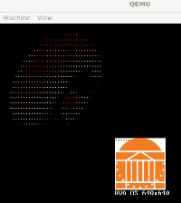
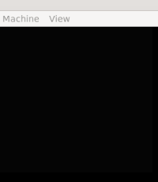
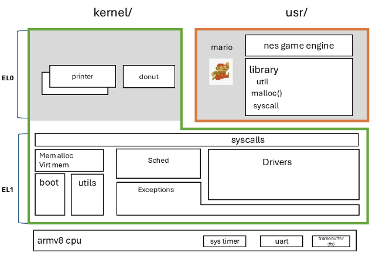

# UVA-OS WORLD3 "Minimal User" 
## To UVA students: the code will become available in Sp25

This is one part of the UVA-OS class (CS4414/CS6456). 

[OVERVIEW](https://github.com/fxlin/cs4414-main) |
[WORLD1](https://github.com/fxlin/uva-os-world1) |
[WORLD2](https://github.com/fxlin/uva-os-world2) |
[WORLD3](https://github.com/fxlin/uva-os-world3) |
[WORLD4](https://github.com/fxlin/uva-os-world4) |
[WORLD5](https://github.com/fxlin/uva-os-world5) 

### Students: see [quests-lab3.md](quests-lab3.md)

## GALLERY





https://github.com/user-attachments/assets/be13c2d8-4a9b-45e6-b848-5fbd3087f072

<video controls src="mario lab3 scr.mp4" title="Title"></video>

## DESIGNS



This OS introduces virtual memory and user/kernel separation. It provides syscalls and can run one or multiple "Mario" applications concurrently in userspace.

✅ Virtual memory 

✅ User/kernel separation (EL0/EL1)


✅ Syscalls: fork/write/exec/sbrk/write

✅ Userspace (two simple apps + a minimal library)

⛔ No files or filesystems
⛔ No input device (can't control Mario)


## Build

```sh
# for QEMU
export PLAT=rpi3qemu
# or, for rpi3
export PLAT=rpi3
```

To clean up:
```sh
./cleanall.sh
```

To build everything:
```sh
./makeall.sh
```

## Run

To run on QEMU:
```sh
./run-rpi3qemu.sh
```

To run on rpi3:
(WSL2) To copy the kernel image to `d:/tmp/`:
```sh
cp kernel8-rpi3.img /mnt/d/tmp/kernel8-rpi3.img
```

Insert SD card, copy to SD card:
```sh
copy "d:\tmp\kernel8-rpi3.img" f:\kernel8-rpi3.img
```

Faster way:
Copy `scripts/9999-download.bat` and `scripts/delay-exit.bat` to Windows desktop, then double-click `9999-download.bat`.
