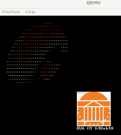
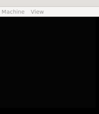
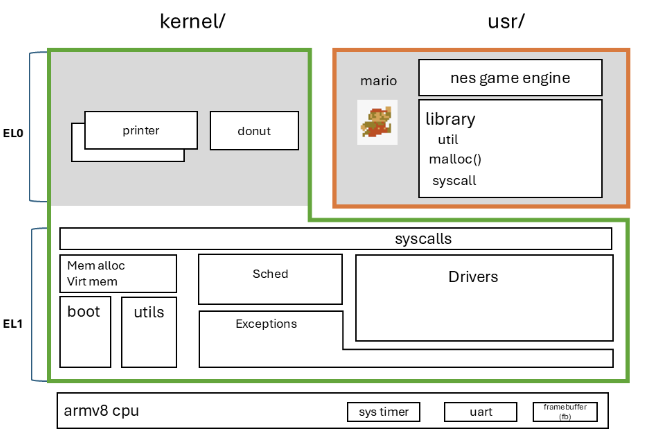

# UVA-OS Lab3 "Minimal User" 
## To UVA students: the kernel code will be available after the submission opens

This is one part of the UVA-OS class (CS4414/CS6456). 

[OVERVIEW](https://github.com/fxlin/cs4414-main) |
[LAB1](https://github.com/fxlin/uva-os-world1) |
[LAB2](https://github.com/fxlin/uva-os-world2) |
[LAB3](https://github.com/fxlin/uva-os-world3) |
[LAB4](https://github.com/fxlin/uva-os-world4) |
[LAB5](https://github.com/fxlin/uva-os-world5) 

### Students: see [quests-lab3.md](quests-lab3.md)

## GALLERY





https://github.com/user-attachments/assets/be13c2d8-4a9b-45e6-b848-5fbd3087f072

<video controls src="mario lab3 scr.mp4" title="Title"></video>

## DESIGNS



This OS introduces virtual memory and user/kernel separation. It provides syscalls and can run one or multiple "Mario" applications concurrently in userspace.

✅ Virtual memory 

✅ User/kernel separation (EL0/EL1)


✅ Syscalls: task related (fork/exec/sbrk/exit...); write (simplified)

✅ Userspace (two simple apps + a minimal library)

⛔ No files or filesystems
⛔ No procfs or devfs 
⛔ No input device (can't control Mario)


## QUICKSTART

### For rpi3 (QEMU)

```
export PLAT=rpi3qemu
```

| Action                      | Command                   |
|-----------------------------|---------------------------|
| To clean up                 | `./cleanall.sh`           |
| To build everything         | `./makeall.sh`            |
| To run on qemu              | `./run-rpi3qemu.sh`       |
| Launch qemu for debugging   | `./dbg-rpi3qemu.sh`       |

### For rpi3 (hardware)
```
export PLAT=rpi3
```

| Action              | Command             |
|---------------------|---------------------|
| To clean up         | `./cleanall.sh`     |
| To build everything | `./makeall.sh`      |

<!-- (One time): get a blank SD card, burn the provided image with Win32DiskImager, 
balenaEtcher, or Raspberry Pi Imager.  -->

(One time): Prepare the SD card

https://github.com/fxlin/uva-os-main/tree/main/make-sd


Copy the kernel image `kernel8.img` to the partition named `bootfs` and boot. 
