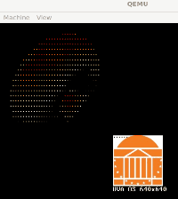
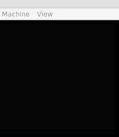

# Quests for World 3 "Min User"

Total estimated time: XXX hours


| Quest                       | Short Description                                                                 | Credits |
|-----------------------------|-----------------------------------------------------------------------------------|---------|
| Quest01: kernel virtaddr     | Boot kernel on virtual address space, set up pagetables, enable MMU.              |  30       |
| Quest02: user helloworld     | Create a kernel task, move it to user space, implement `write()` syscall.         |  20       |
| Quest03: two user printers   | Support user task to fork another, both print messages from user space.           |  20       |
| Quest04: user donut          | Run a user task that renders a donut, map framebuffer, support dynamic memory.    |  20       |
| Quest05: user donut on rpi3 | Run donut task on rpi3, handle CPU cache flushing.                          |    20     |
| Quest06: mario               | Run "Super Mario Bros (1983)" as a user task, support exec syscall, render game.  |  30       |
| Quest07: mario on rpi3| Run Mario game on rpi3, record gameplay video.                                    |   20      |

#### Total credits: 150 (main 85; side 65)
Credits exceeding 100 will be considered as bonus.


**NOTE**. In all writeup below, we will refer to C function names and assembly
labels. We will not always give out the file names. To quickly locate them, use
vscode `ctrl+t` for C functions and `ctrl+shift+f` for assembly labels.

**NOTE**. In all coding exercise below, see the comments in the code for hints
and instructions.

**NOTE**. For picture/video deliverables, see [requirements](submission.md).

Debugging strategy: 
- From prior labs we know GDB can stop at certain kernel symbol. 
Example: to stop at el0_sync, launch the kernel with GDB then do "b el0_sync", and "r". 

- GDB can also set breakpoint for user code (or kuser code). It just needs the correct virtual address. 
Example: we wanted to set breakpoint for user_process_hello(). 
From kernel8.sym, we can find its address is 0xffff000000081070; and user_begin is at 0xffff000000081000;
user_process_hello is 0x70 after the user_begin. 
Since move_to_user_mode() will copy user_begin at user VA of 0, so user_process_hello is at 0x70 in user UA. 

    - In GDB, do "b *0x70" and then "r". Once the code execution indeed reaches user_process_hello(), GDB will stop. 
    - If there are multiple user tasks and the cpu is switched across their VMs, GDB will stop whenver the current task's
PC hits 0x70.

## 🗺️ Quest01: kernel virtaddr

OVERVIEW: we will boot the kernel on its virtual address space. To do so, 
we change the kernel linking address, set up the kernel pagetables, enable MMU, 
and jump to the virtual address of `kernel_main`.

Use GDB to debug as you code. However, source-level debugging is not available until
MMU is on (see the comments in `boot.S`).

STEPS

- Understand the kernel virtual memory layout.

- Revise the linker script (linker-rpi3qemu.ld) so that the kernel symbols start from the virtual address. 

- Understand boot.S and how it uses the two functions `create_kern_pgtables` and `create_kern_idmap`, implemented in vm.c
Complete the latter two functions, as well as the few functions they invoke. 

- Complete boot.S: set up the kernel *virtual* stack and load the virtual address
of `kernel_main`, so that the kernel execution can reach
`kernel_main()`. As part of this, figure out the memory attributes: `MAIR_VALUE` defined in `mmu.h`.

The above should have set the kernel virtual address space (kernel VA).  
Now the kernel should boot on physical addr (PA), turn MMU on, continue on VA, 
and eventually reach kernel_main(). 
You should see a familiar message; 
but this time it shows kernel starting from VA. 

````
------ kernel boot ----- core 0
VA_START ffff000000000000
build time (kernel.c) ...
````
To debug a non-boot "blank screen", use GDB to trace from boot.S to kernel.c. 


## 🗺️ Quest02: user helloworld

OVERVIEW: we will create a kernel task and move it to user space. 
We will set up the user virtual addresses and implement a `write()` syscall 
so that the user task can print a message. 

> The code for the user task is compiled and linked into the kernel image (we called this "kuser").

Reference output [here](user-helloworld-output.txt)

- From kernel.c, understand the creation order of `kernel_main`, the idle task, 
the init task, and `kernel_process()`. Understand how `copy_process()` is used. 

- CHECKPOINT. The "kern-1" task is created and kernel_process() is reached, printing "Kernel process started..."
  
- Understand the relation between `kernel_process()` and `move_to_user_mode()`. 
Complete `move_to_user_mode()`, which allows an existing kernel task (`kernel_process()`) to be lifted to user mode.

- In `kernel_process()`, call `move_to_user_mode()` on `user_process_hello()`. 

- CHECKPOINT. Use GDB to trace the execution returning from `kernel_process()`, to `ret_from_fork`, to `kernel_exit()`, 
to switch to EL0, and finally land on the first instruction of the user task.
However, besides executing instructions, the user task cannot show any sign of life yet. 

- Complete the syscall path for write(), which should go to our console driver and send chars on UART: 
(kuser_sys.S) `call_sys_write()` -> (vectors) `el0_sync` -> `el0_svc` -> `sys_call_table` -> `sys_write()` -> `consolewrite()`.
Complete any missing code piece along the path.
To debug, use GDB to set breakpoints at these code locations and see if your code reach there. 

> At this time, our path of `call_sys_write()` is simplified, ignoring its `fd` argument.
It only writes to the console device.

- Understand console.c. Complete `consolewrite()`, which sends a sequence of chars to UART. 

- With the syscall path completed, the task should be able to print a message from user mode. 

DELIVERABLE: Show a photo of the message.

## 🗺️ Quest03: two user printers

OVERVIEW: now we have a user task running. We will support this task to do the fork() syscall from userspace,
creating another user task. 
The parent and child then print their own messages from the userspace. 

- Understand `user_process_printers()` (kuser.c) which is the body of the user tasks. 
It will fork a child task, and the parent and child will print their own messages.

- Revisit and complete `copy_process()` in sched.c, so that it can fork a user task (in addition to the existing capability of creating a kernel task).

- `copy_process()` will call `dup_current_virt_memory()` in vm.c, which is the core function for manipulating the user VM (virtual memory). Complete `dup_current_virt_memory()`.

- Complete the syscall path for fork: (kuser_sys.S) `call_sys_fork()` -> (sys.c) sys_call_table -> `sys_fork()` -> `copy_process()`.

- In a similar fanshion, complete the syscall path for exit, starting from `call_sys_exit()`.

- in `kernel_process()`, call `move_to_user_mode()` on `user_process_printers()`.
    - make sure you understand how move_to_user_mode() works and what happens after kernel_process() returns. 

Reference output [here](user-2-printers-output.txt)

CHECKPOINT: shoot a video of the two tasks printing their own messages.

## 🗺️ Quest04: user donut 

OVERVIEW: with the mechanisms for launching user tasks (via `move_to_user_mode`) 
and forking user tasks in place, we will now run a user task that renders a donut.

To do so, we will need to: 
- map the framebuffer to the user space so that the user task can 
render to the screen.
- load much larger program code into the user space.
- support a user task to do dynamic memory allocation, which grows its virtual memory space at run time. 

Reference output [here](user-donut-output.txt)

STEPS

- Complete `move_to_user_mode_donut()` so that:
    - it allocates as many code pages as needed by the user program
    - it maps the framebuffer to the user addr space
    - it preps the arguments expected by the donut program

- CHECKPOINT. 
Test `move_to_user_mode_donut()` by calling it to move the aforementioned
**printer tasks** (not donut) to user mode. These tasks should work as before. 

- Understand kuser_donut.c and its difference from the donut code in previous labs. 

- Understand the semantics of sbrk. 
Complete `user_donut()` so that it uses the `call_sys_sbrk()` syscall to allocate buffers. 

- Complete the syscall path for `sbrk()`: 
kuser_sys.S `call_sys_sbrk()` -> sys_call_table `sys_sbrk()` -> `growproc()`.
Complete `sys_sbrk()` in sys.c and `growproc()` in vm.c.

- Call `move_to_user_mode_donut()` on the donut code user_donut(). 

DELIVERABLE: shoot a video of the donut running at full speed. 

- In the same spirit, complete the syscall path for sleep: `call_sys_sleep()` -> ... -> `sys_sleep()`. 
Understand how `sys_sleep()` uses virtual timers to implement sleep; 
complete the function. 
Cf `test_ktimer()` for the use of ktimer kernel APIs.

> Be careful: 
The sleep syscall (call_sys_sleep(), sys_sleep(), etc.) has different
    semantics from the kernel function sleep().
    - The sleep syscall deschedules a user task for a certain amount of time.
    - The kernel function waits on an address to be signaled.
    - The former is implemented atop the latter.

- Call `call_sys_sleep()` from user_donut(): sleep a bit after rendering each frame, 
so that the donut spins slower. You decide where to place the call. 

DELIVERABLE: shoot a video of the donut running slower. 



## Quest05: user donut on rpi3

- Run the code above on the rpi3. See if there is any display output. 

- Understand the need for flush CPU cache. In the codebase, search for
`user_flush_dcache_range()`, and understand its the address range for cache
flush.

- Understand why cache flush cannot be done at EL0. 

- To work around the the above issue, decide a place a call to `user_flush_dcache_range()`. 

DELIVERABLE: shoot a video of the donut running on the rpi3 display. 

Reference (donut running at full speed. Compared to lab2, this is faster likely 
because of the CPU cache is on).

https://github.com/user-attachments/assets/0a5e1d72-4cf7-4002-a59f-69eb9c83015f

## Quest06: mario

OVERVIEW: we will run "Super Mario Bros (1983)" as a user task. 
The game runs atop an emulator (nes0). We will: 

- support the exec syscall
  
- complete basic rendering function in nes0 

> Suppose you are running QEMU:
it's an emulator (nes0) inside an emulator (QEMU), 
which itself is inside a virtual machine (WSL2 or VMWare), which is on your PC or Mac. 

Unlike donut, nes0 is a more  independent user program.
The source code of nes0 is in a separate directory of its own, off the kernel source tree. 
The compilation and linking process of nes0 is independet of the kernel compilation and linking.
After producing the nes0 executable binary (nes-min, an elf file), 
the kernel build process will include it into the kernel image. 
When the kernel image is loaded to memory, the nes0 binary is also loaded as part of the 
kernel image. 
At the runtime, the kernel will locate the nes0 binary in memory, 
parse the elf, copy the code and data sections to a task's memory (user portion),
and exec() the code as a user task.

See the "World Map" above for an illustration. 

NOTE: from this quest on, you starts dealing with another codebase (usr/nes0) in addition
to the kernel (kernel/). 
The description below differeniates between the two codebases as "usr" and "kernel".

NOTE: `./makeall.sh` should fully rebuild the user program (e.g. mario); but you can be safe by doing `./cleanall.sh && ./makeall.sh` every time.

STEPS

- [usr] Grasp the structure of the nes0 codebase. Start from usr/LiteNES/Makefile. 

- [usr] Complete usr/LiteNES/main0.c, so it accepts arguments from the exec() syscall.

- [kernel] Update kernel/Makefile, so that the nes0 binary is included in the kernel image. 
Update linker-rpi3qemu.ld so that the bytes of nes0 binary are placed after the symbol `nes_start`. 

<!--- - [kernel] Complete the syscall path for `exec()`. (usr/usys.S) `exec()` -> (kernel) `sys_exec()` -> `exec0()`. Pay attention to the use of `nes_start`.
> Since nes0 is no longer "kuser", its syscalls no longer go through kuser_sys.S;
instead, they go through the a simplistic C library which has syscall wrappers (usys.S).
See "world map" for details. --->

- [kernel] 
Understand `user_process_mario()` in kuser.c.
In `kernel_process()`, call `move_to_user_mode_donut()` (which maps many code pages and framebuffer) on `user_process_mario()`. 

- [kernel] Complete the syscall path for `exec()`. (kuser_sys.S) `syscall_exec()` -> (kernel) `sys_exec()` -> `exec0()`. Pay attention to the use of `nes_start`.

> Although nes0 is no longer "kuser", it is launched by a kuser task calling syscall_exec(), which is through the in-kernel syscall wrapper (kuser_sys.S). 
As nes0 runs, all its syscalls no longer go through kuser_sys.S;
instead, they go through the a simplistic C library which has syscall wrappers (usys.S).
See "world map" for details.

- [kernel] Understand `exec0()` in exec0.c. Complete the function so that: 
    - it loads the elf binary into the user space; 
    - it passes arguments to the user task;
    - it maps framebuffer area to the user space; 
    - it sets the pagetable tree for the user task.

CHECKPOINT. build nes0 & kernel. 
In usr/LiteNES/main0.c, main() should correctly print out the arguments passed from the exec0() syscall. 
Check for correctness. At this time, no game graphics yet. 
Reference output [here](mario-output-1.md).

- [usr] Understand usr/LiteNES/hal0.c. Complete functions for flushing the game grapihcs buffer 
and for copying the pixels to the framebuffer. 

CHECKPOINT. The game title screen should show up. 
You should be able to see the sign of life: a coin on the screen top is flickering; 
if you wait for a while, Mario will start to dash.

As it runs, 
nes0 periodically prints out actual FPS to console (via the write() syscall, 
now through the user wrapper).
On WSL2 and Dell XPS15 (2020), the FPS is around 33.

Reference output [here](mario-output-1.md).

The game does not accept any input -- we have not implemented input device yet. 

DELIVERABLE. Record a short video. 



## Quest07: mario on rpi3

- Run the code above on the rpi3. 

DELIVERABLE. Record a short video. 

https://github.com/user-attachments/assets/be13c2d8-4a9b-45e6-b848-5fbd3087f072

<video controls src="mario lab3 scr.mp4" title="Title"></video>

